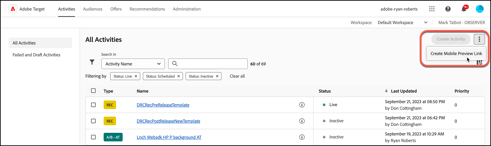
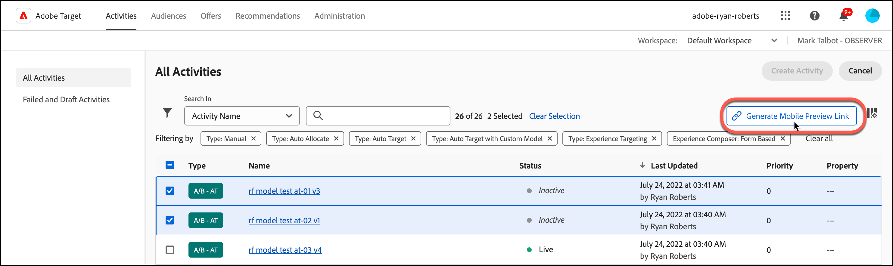
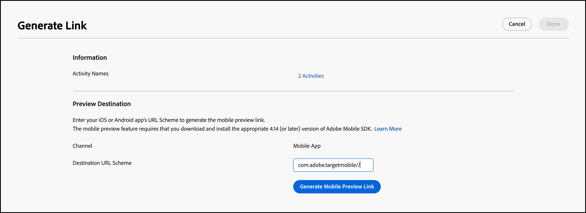
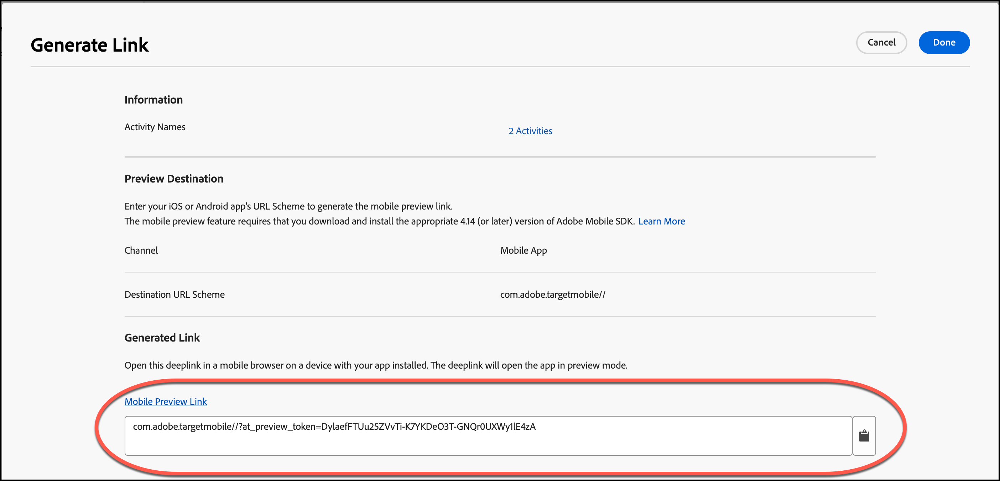

# [!DNL Target] mobilförhandsgranskning

Använd länken för förhandsgranskning av mobilmaterial för att enkelt skapa heltäckande QA för mobilappsaktiviteter och registrera dig för olika upplevelser direkt på din enhet utan några särskilda testenheter.

## Ökning

Med funktionen för mobilförhandsgranskning kan du testa mobilappsaktiviteterna innan du startar dem live.

## Förutsättningar

1. **Använd en version av SDK som stöds:** Mobilförhandsvisningsfunktionen kräver att du hämtar och installerar rätt version av Adobe Mobile SDK i dina motsvarande appar.

   Anvisningar om hur du hämtar rätt SDK finns i [Aktuella SDK-versioner](https://developer.adobe.com/client-sdks/documentation/current-sdk-versions/){target=_blank} i *[!DNL Adobe Experience Platform Mobile SDK]* dokumentation.

1. **Konfigurera ett URL-schema:** Förhandsgranskningslänken använder ett URL-schema för att öppna programmet. Du måste ange ett unikt URL-schema för förhandsgranskningen.

   Mer information finns i [Visuell förhandsgranskning](https://developer.adobe.com/client-sdks/documentation/adobe-target/#visual-preview){target=_blank} in *Adobe Target* i *[!DNL Adobe Experience Platform Mobile SDK]* dokumentation.

   Följande länkar innehåller mer information:

   * **iOS**: Mer information om hur du anger URL-scheman för iOS finns i [Definiera ett anpassat URL-schema för din app](https://developer.apple.com/documentation/xcode/defining-a-custom-url-scheme-for-your-app){target=_blank} på Apple Developer webbplats.
   * **Android**: Mer information om hur du anger URL-scheman för Android finns i [Skapa djupa länkar till appinnehåll](https://developer.android.com/training/app-links/deep-linking){target=_blank} på Android Developers webbplats.

1. **Konfigurera `collectLaunchInfo` API (endast i0S)**

   Mer information finns i [Visuell förhandsgranskning](https://developer.adobe.com/client-sdks/documentation/adobe-target/#visual-preview){target=_blank} in *Adobe Target* i *[!DNL Adobe Experience Platform Mobile SDK]* dokumentation.

## Skapa en förhandsgranskningslänk

1. I [!DNL Target] Gränssnitt, klicka på **[!UICONTROL More Options]** ikonen (den lodräta ellipsen) och välj **[!UICONTROL Create Mobile Preview]**.

   

1. Markera de aktiviteter som du vill förhandsgranska och klicka sedan på **[!UICONTROL Generate Mobile Preview Link]**.

   >[!NOTE]
   >
   >Endast formulärbaserade AB- och XT-aktiviteter kan väljas.

   

1. Ange appens URL-schema.

   Detta måste vara samma som i din iOS- eller Android-app. Upprepa vid behov den här processen separat för iOS och Android.

   

1. Klicka **[!UICONTROL Generate Mobile Preview Link]** och sedan kopiera länken.

   

## Förhandsgranska på din enhet

Öppna länken i en mobilwebbläsare på en enhet där appen är installerad. Den här appen kan vara den produktionsapp du hämtade från Apple App Store eller Google Play Store. Det behöver inte vara en specialbyggnad. Om du har en aktiv förhandsgranskningslänk kan du visa upplevelserna på enheten.

1. Öppna länken i din webbläsare.

   Dela länken som du kopierade i föregående steg från [!DNL Target] Användargränssnittet till din mobila enhet på ett bekvämt sätt, till exempel med text, e-post eller Slack.

   |||

   Din app öppnas och startar [!DNL Target] Mobilförhandsgranskningsläge.

1. Välj den kombination av upplevelser du vill se och klicka sedan på **[!UICONTROL Launch Experiences]**.

   |||| ||||

## Begränsningar

* Vyn måste läsas in igen för att det nya innehållet ska visas efter **[!UICONTROL Launch Experiences]** klickas på knappen. Det enklaste sättet är att växla till en annan skärm och sedan gå tillbaka till skärmen där du väntar dig att ändringen ska ske.
* Mobilförhandsvisning stöds inte för Android-versioner tidigare än API-19 (KitKat).
